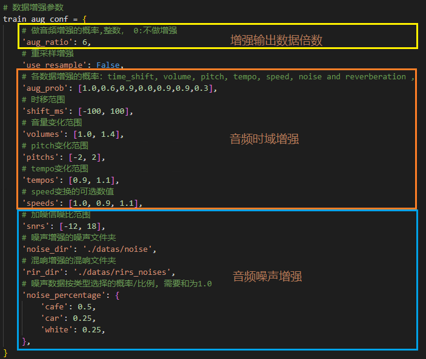
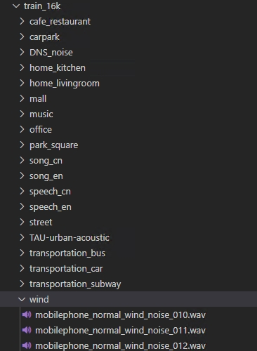
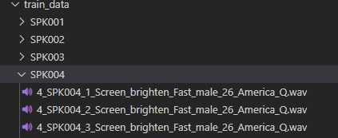
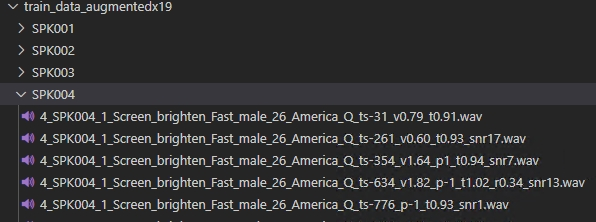
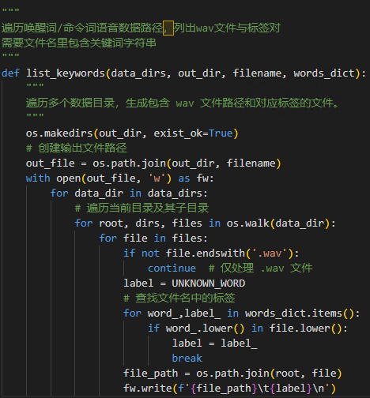
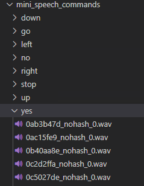
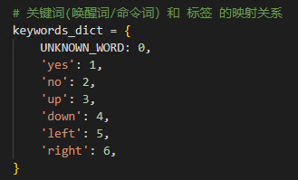
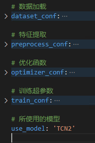
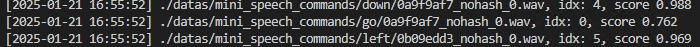
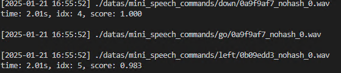

# 语音唤醒训练工程使用说明
## 唤醒词数据要求
 - 采样率 `16k`
 - 单通道 `mono`
 - 文件格式 `wav`
 - 时长 `2s`以内

## 使用环境：
 - Anaconda 3
 - Python 3.10
 - torch 1.13
 - Ubuntu 18.04/22.04

更加详细的依赖包参见 [requirements.txt](./requirements.txt)

## 工程运行
工程运行是依次执行python文件完成。
- 数据增广：（可选）可尝试增广，提升模型在某些域上的性能。
- 数据列举：（必须）需要将所有参与训练的音频数据列出并给与相应的标签值。
- 特征提取：（可选）提取特征存储成文件，避免多次训练多次提取特征。
- 模型训练：（必须）基于特征数据，做模型参数训练。
- 模型测试：（可选）测试验证模型性能。

### 1.数据增广（可选做）
音频数据的增广，增加训练数据量，提升模型的泛化性能。

```shell
python run_kws_data_augment.py
```
参数解析
- train_aug_conf ：音频数据增强的参数配置。总体上分为3部分

    

    - 增强倍数`aug_ratio` ： 对原始数据的倍数扩增，需要是整数，0表示不增强。增强后的数据量 = 原数据量 * audio_augment_ratio。
    - 音频时域增强 ：有**时移变化**、**音量变化**、**音调变化**、**语速变化**,都是直接对音频`PCM`数据做调整。
        - aug_prob ： 数值表示各个音频时域增强方式的概率/比例，数值范围[0, 1.0]，0表示不做增强。如设置数值 `'1.0,0.0,0.8,0.8,0.8,0.3'`，对应于 `时移、音量、音调, 语速, 加噪，混响`，那么依次表示如下：
        - 1.0 ： 所有数据都做 `时移` 增强。
        - 0.0 ： 所有数据不做 `音量` 增强。
        - 0.8 ： 所有数据以 `0.8` 的概率做 `音调` 增强 
        - 0.8 ： 所有数据以 `0.8` 的概率做 `语速` 增强 
        - 0.8 ： 所有数据以 `0.8` 的概率做 `加噪` 增强 
        - 0.3 ： 所有数据以 `0.3` 的概率做 `混响` 增强 
    - 音频噪声增强 ：**加噪声**、**加混响**。建议噪声数据集的收集尽可能覆盖产品的使用场景的噪声。并且以噪声种类为子文件夹，存放各种类的噪声数据。

    **训练数据加噪所使用的噪声数据组织结构示意图**

    
    

- data_dir ：原音频数据的路径，一般是指安静场景下录制的 唤醒词语音 `wav` 文件的路径。
唤醒词语料数据的组织，一般默认以录音人的 `ID` 作为子文件夹，音频文件存放在子文件夹里，并且需要文件名包含关键字的字符串，以方便知晓音频数据的语音内容，也就是对应的标签。

    **唤醒词数据组织结构示意图**

    

- out_dir ：数据增强后输出的数据路径

    **数据增强后的结构示意图**

    

- process_num ：数据增强的多线程数量。数据增强的脚本程序内部支持开启多个进程并行做，节省时间。
- sample_rate : 音频数据的采样率，默认都是16000.


### 2.数据列举
列出所有用于模型训练的音频数据的路径，并给与相应的标签值，将结果写入文本。
```
python run_list_datas.py
```
该脚本需要使用者根据自己的数据存放方式，去编写数据列举的函数。
如上述，默认需要唤醒词文件名包含唤醒关键字的字符串，所以唤醒词的列举，只需要给定一个**文件路径**和**关键词与标签数值对应字典**，即可搜索出。参考脚本 `run_list_datas.py` 中函数 `list_keywords`。



如果你的唤醒词文件名不包含相应的关键字, 此时就需要使用者根据实际的文件存放结构去确定音频文件对应的标签。如示例中的数据集 `mini_speech_commands`，此时可以参考脚本 `run_list_datas.py` 中函数 `list_examples`。



前面提到**关键词与标签数值对应字典**，模型训练使用的标签都是数字，所以需要将唤醒词或命令词映射为数字，可以参考示例脚本中对数据集 `mini_speech_commands` 的字典映射。



最终生成的`training_datas.txt`文件内容如下：
```
./datas/mini_speech_commands/down/0132a06d_nohash_1.wav	4
./datas/mini_speech_commands_aug6/right/b43c8f2f_nohash_0_ts16_v1.15_p-1_sp1.0_snr-10.wav	6
./datas/mini_speech_commands_aug6/up/c1d39ce8_nohash_6_ts-77_v1.01_p-2_sp1.0_snr7.wav	3
./datas/mini_speech_commands_aug6/go/6c0f6493_nohash_1_ts-48_p-2_sp1.1_snr14_rev.wav	0
./datas/mini_speech_commands_aug6/stop/f5733968_nohash_3_ts51_v1.01_p-1_sp1.1_snr-4_rev.wav	0
./datas/mini_speech_commands_aug6/right/9ff2d2f4_nohash_4_ts14_v1.30_sp1.1_snr1.wav	6
./datas/mini_speech_commands_aug6/yes/0137b3f4_nohash_2_ts-27_v1.13_p-1_snr-11.wav	1
```

#### 补充
KWS的模型是基于深度学习的分类网络模型，如果只包含唤醒词/热词的数据，那么模型只会分类出唤醒词，也就是说，无论是什么音频被强制分类到其中某一类，这明显是不合理的。因此，需要增加一类，用以识别非唤醒词的语音音频，我们称为 `other` 或者 `unknown` 类。这样，我们可以将KWS训练数据非为如下两类：
- 正样本数据：唤醒词/命令词语音数据及其增强数据。
- 负样本数据：常规语音数据，与唤醒词无关。如噪声、音乐、电视、生活中的对话语音等。
在示例中的数据集 `mini_speech_commands`，将 `go` 和 `stop` 作为了`unknown` 类。


### 3.特征提取（可选做）
将 `wav` 文件的时域数据转换到频域，提取频域特征
```shell
python run_feature.py
```
在 `run_feature.py` 脚本程序的参数说明：
- process_num ：多线程处理的数值，加速特征提取过程。
- list_file : 音频文件列表文件，也就是 `run_list_datas.py` 输出的文件。
- feat_npy ：提取特征的存储文件，这里使用`npy`文件去存储特征数据。

### 4.模型训练
#### 配置文件
模型训练需要使用到一个训练配置文件 `configs/tcn.yml`, 包含**数据加载**、**特征提取**、**优化函数**、**训练超参数**、**使用的模型**。



- 数据加载 ：设置数据加载及处理的配置参数。
    - use_raw ：是否直接使用音频原始数据进行模型训练，`True`使用原始音频数据，`False`使用特征数据。
    - train_list ：训练数据路径列表。如果`use_raw`设为`True`，则配置成`run_list_datas.py` 输出的文件，否则配置成`run_feature.py`输出的特征存储文件。
    - min_duration ：过滤过短的音频文件。一般说唤醒词不会低于`0.2s`,可以根据实际情况去配置。
    - max_duration ：过滤掉过长的音频文件。一般说唤醒词语音时长在`0.7s`到`1.7s`，所以模型输入设置的是`2s`的数据，超出的会被截断丢弃。
    - use_spec_aug ：谱曾强。目前还不支持。
    - dataLoader ：数据加载器，可以根据需要调整`batch_size`等参数。
- 特征提取 ：提取特征的参数配置。如果`use_raw`设为`True`，则在训练时，同时读取音频数据，提取特征，同时训练。
- 优化函数 ：根据需要配置修改。
    - optimizer ：优化方法，支持Adam、AdamW、SGD。
    - learning_rate ：初始学习率
    - weight_decay ：学习率衰减系数
    - scheduler ：支持 CosineAnnealingLR，WarmupCosineSchedulerLR
- 训练超参数 ：配置训练的迭代次数和打印日志的频次。
    - max_epoch ：模型训练最大的迭代Epoch，通常可以设置为100或者200。
    - log_interval ：每个多个batch打印一次训练中间日志。
- 使用的模型 ：
    - use_model：默认只有`TCN2`。后续推出可供用户自定义模型结构的方式。

#### 训练执行
```shell
# torchrun --standalone --nnodes=1 --nproc_per_node=4 run_kws_train.py --gpus='4,5,6,7'
torchrun --standalone --nnodes=1 --nproc_per_node=1 run_kws_train.py --gpus='0'
```
模型训练默认支持单机器上的多`GPU`训练。可以根据需要去配置使用的`GPU`。可以参考`kws_train.sh`。
```shell
gpus='4,5,6,7'
comma_count=$(echo "$gpus" | grep -o ',' | wc -l)
nproc_per_node=$((comma_count+1))
torchrun --standalone --nnodes=1 --nproc_per_node=${nproc_per_node} run_kws_train.py --gpus=${gpus}
```

#### 继续训练
如果已经存在上次训练的模型，再次执行训练会默认会加载上次最后一个Epoch模型，并加载相应的状态参数，如学习率，并继续训练。
如果想指定继续的位置，可以使用参数“--checkpoint”，如下所示
```shell
gpus='4,5,6,7'
comma_count=$(echo "$gpus" | grep -o ',' | wc -l)
nproc_per_node=$((comma_count+1))
torchrun --standalone --nnodes=1 --nproc_per_node=${nproc_per_node} run_kws_train.py --gpus=${gpus}  --gpus=${gpus} checkpoint=models/TCN2/epoch_50
```

#### 使用预训练模型
如果有一个原先训练好的模型，只想在此模型基础上做微调，则可以加载预训练模型。
使用参数“--pretrained”，如下所示
```shell
gpus='4,5,6,7'
comma_count=$(echo "$gpus" | grep -o ',' | wc -l)
nproc_per_node=$((comma_count+1))
torchrun --standalone --nnodes=1 --nproc_per_node=${nproc_per_node} run_kws_train.py --gpus=${gpus}  --pretrained=./models_pretrained/TCN2/epoch_9/model.pth
```

**训练打印的日志**
```
[01/21 10:09:15 INFO kws_trainer.py:304] Epoch: [3/100], batch: [100/653], loss: 1.86512, acc: 0.26156, lr: 0.00086695, eta: 0:16:27
[01/21 10:09:17 INFO kws_trainer.py:304] Epoch: [3/100], batch: [200/653], loss: 1.85012, acc: 0.26438, lr: 0.00092790, eta: 0:19:22
[01/21 10:09:19 INFO kws_trainer.py:304] Epoch: [3/100], batch: [300/653], loss: 1.84523, acc: 0.26156, lr: 0.00098885, eta: 0:19:44
[01/21 10:09:21 INFO kws_trainer.py:304] Epoch: [3/100], batch: [400/653], loss: 1.82286, acc: 0.27125, lr: 0.00104980, eta: 0:20:07
[01/21 10:09:23 INFO kws_trainer.py:304] Epoch: [3/100], batch: [500/653], loss: 1.82123, acc: 0.28187, lr: 0.00111075, eta: 0:19:21
[01/21 10:09:24 INFO kws_trainer.py:304] Epoch: [3/100], batch: [600/653], loss: 1.82733, acc: 0.28531, lr: 0.00117170, eta: 0:19:21
```
包含了`Epoch`、`batch`、`loss`、`acc`、`lr`、`eta`等信息。其中`eta`是预计剩余需要时间，总体上估计，没那么精确。

_补充_：日志分析
```
tensorboard --logdir=./models/TCN2/tensorboard_log --port=10086
```
在浏览器上输入地址： <http://localhost:10086/> ，可查看训练日志信息

### 5.模型测试
```shell
python run_kws_decode.py
```
模型性能测试模块较为简单，提供两个解码函数。
- 直接推理解码

直接将音频提取特征送给模型进行推理，输出识别的结果。 对每个样本取前2秒（不足2秒补零）。
具体的参考函数`decode`。

**直接推理解码的测试日志**



- 滑窗解码

仿真流式解码，使用每一样本的全部数据，输出所有唤醒结果。
使用一帧帧滑动窗口的方式实现每一帧输出一个结果，等价于流式解码结果。
 可测试唤醒词的唤醒率，也可以用来测试误唤醒率
具体参考函数`slide_window_decode`。

**滑窗解码的测试日志**


